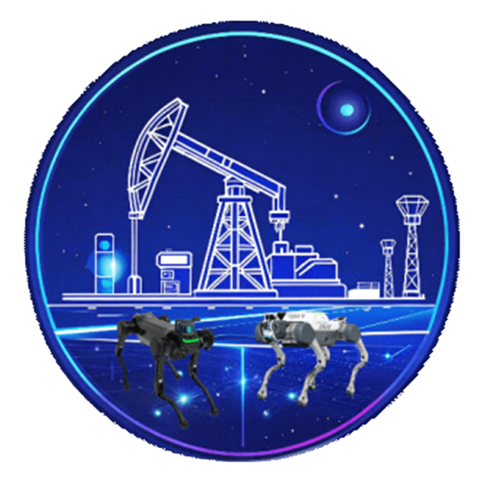
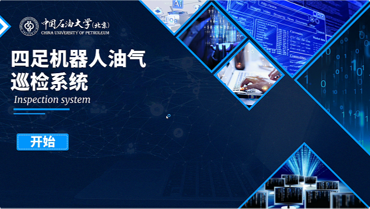
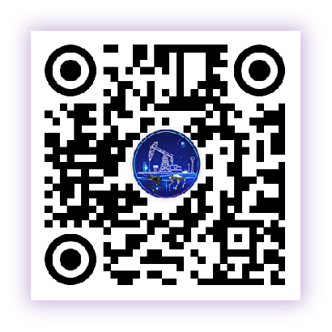
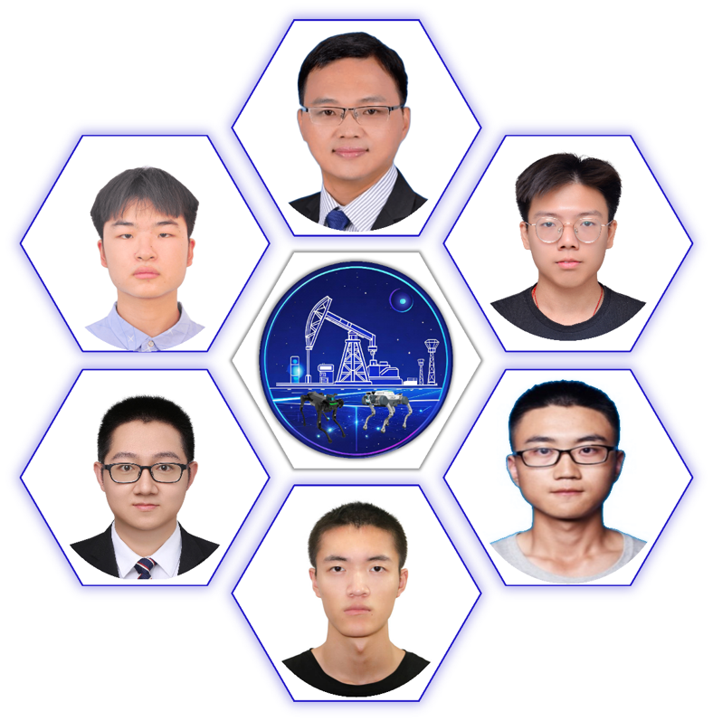

<div align="center">

<p align="center">
  
</p>


**油“孪”而生（Intelligent Oil and Gas &Digital Twin）**

**基于数字孪生的油气生产安全管理解决方案**


<p align="center">
   🌐 <a href="https://chatglm.cn/blog" target="_blank">官方主页</a> • 🤗 <a href="https://huggingface.co/WS" target="_blank">HF Repo</a> • 🐦 <a href="https://twitter.com" target="_blank">Twitter</a> • 📄<a href="#" target="_blank"> Report </a> <br>
</p>
<p align="center">
    👋 加入我们的 <a href="https://www.cup.edu.cn/cupai/szdw/jsml/11de65b0b57d43a7a0aba2a5cc79681a.htm" target="_blank">团队</a>
</p>

[](LICENSE)
[](https://github.com/PetroGPT/PetroGPT/master)


</div>

##  概述
油孪而生平台是由中国石油大学（北京）图像与视觉研究团队 基于四足机器人、数字孪生技术、虚拟仿真平台、 仿生运控控制 ... 构建的基于数字孪生的四足机器人油气站场智能巡检平台，旨在通过数字孪生技术实现对油气生产环境、设备、设备参数、设备运行状态的实时监控和自动化管理。
你好
###  功能结构图


###  技术体系
* 前端：TypeScript + Vue3  + VueX + Element Plus。
* 后端：Python3 + Flask  + Java8  + SpringBoot2/3 + Sa Token + Mybatis-plus。
* 中间件：Redis + SqLite3 + Neo4j + Nginx。
* 深度学习技术：强化学习、Yolo目标检测、ChatGLM-6B、Lora微调技术...


##  项目介绍

油气资源是国家经济发展的重要支撑，然而油气生产及安全管理不当易引发严重事故。我国正处于油气站场数字化建设的初级阶段，如何应对不断扩大的油气管道建设规模从而实现站场数字化转型成为行业亟需解决的难题。数字化转型的关键是实现物理世界与数字信息世界的相互融合。数字孪生具有实时映射、迭代优化、深度分析、高效决策等特点，作为沟通数字虚拟世界和现实物理世界的有效方法被广泛应用于众多行业，然而目前大多数平台仍存在建模精度低、功能欠佳等问题。本项目搭建的集高精度建模、数据可视分析、油气智能问答大模型、四足机器人自动巡检、油气站场智能诊断一体化的油气站场数字孪生平台，可为油气生产安全管理提供智慧化解决方案。

##  央视采访
2025年1月团队研究成果接受中央广播电视总台 社教节目中心 科教频道 CCTV-10《我的大学》特别栏目采访报道。

完整视频：
【央视报道！看四足机器人进课堂！】 https://www.bilibili.com/video/BV14hrSYcEoU/?share_source=copy_web&vd_source=d623767b2e962dfc6edf5163aa6dd0c2
##  项目动态
* [2024-09-至今] 塔里木、青海石化等油气站场应用。
  
  


* [2024-07-2024.08] 油气泄露模拟可视化。
  * 基于Fluent模拟的油气泄露模拟可视化，通过模拟真实油气环境，实现对燃气泄露的模拟分析。
  * 基于光滑粒子流体动力学(smoothed particle hydrodynamics, SPH)实现真实的气体溢油扩散模拟
   


* [2024-04-2024.06] 智能站场巡检系统。
  * 设计和实现了智能站场巡检系统，实现对油气站场设备参数的实时监控与控制。
  * 通过对数字孪生场景中的站场设备参数的实时监控，同时映射到真实的物理站场,实现智能站场巡检 。
  
  


* [2024-03-2024.04] 四足机器人自动巡检模块实现。
  * 通过在油气站场设置巡检点，通过路径规划算法，实现四足机器人自动巡检。
  
  


* [2023-10-2024.02] 搭建具身智能四足机器人系统。
  * 通过四足机器人感知传感器采集数据，输入通用基础大模型，对四足机器人的关节点和云台进行控制。
  * 驱动四足机器人巡检和目标识别
  
  * 
  


* [2023-09] 基于ISAAC GYM仿真平台，完成四足机器人仿真环境搭建。
  * 尝试搭建四足机器人仿真环境，实现虚拟仿真训练。
  * 在强化学习中加入仿生学，通过捕捉真实动物的运动步态来优化机器狗的动作。


* [2023-08] 完成防爆四足机器人设计。
  * 采用防爆相机和防爆关节电机和防爆电池，对机器狗进行改造，实现对油气安全巡检。
  

* [2023.07-08] 初步完成油气站场三维模型搭建。
  * 通过无人机和四足机器人对油气站场设备进行三维扫描，生成三维模型
  * 基于Unity 3D进行三维模型整合和搭建
  


* [2023.07] 调试四足机器人和无人机等建模设备。
  * 将四足机器人和无人机应用于油气站场环境，实现对设备参数的实时监控与控制。
  


##  ToDo List
- [x] ~~实地部署和应用~~

- [x] ~~油气泄露模拟可视化~~

- [x] ~~智能站场巡检系统~~

- [x] ~~四足机器人路径规划~~

- [x] ~~油气仪表、阀门开关目标识别~~

- [x] ~~基于具身智能的四足机器人巡检系统~~

- [x] ~~四足机器人虚拟仿真+仿生学控制~~

- [x] ~~3D数字孪生油气站场模型搭建~~

- [x] ~~防爆四足机器人构建~~


## 软件安装

### web体验
为了方便用户直接使用，我们提供了[体验网址](https://dsavd.cup.edu.cn/)


<p align="center">
  
</p>
<p align="center">
  
</p>

### 视频演示


完整视频：[视频演示.mp4](assets%2Fvideos%2F%E8%A7%86%E9%A2%91%E6%BC%94%E7%A4%BA.mp4)

### 环境安装

#### 创建conda虚拟环境
```Shell
conda create -n dsavd python=3.8
```
#### 激活环境
```Shell
conda activate dsavd
```
#### 安装torch
```Shell
pip install torch==1.12.1+cu113 torchvision==0.13.1+cu113 torchaudio==0.12.1 --extra-index-url https://download.pytorch.org/whl/cu113
```
#### 克隆仓库
```Shell
git clone https://github.com/AcoderSc/Dsavd.git
cd Dsavd
```

Install the requirements with pip: `pip install -r requirements.txt`. `transformers` library version is recommended to be `4.27.1`, but theoretically any version no lower than `4.23.1` is acceptable.

### Usage

Generate dialogue with the following code

```python
>>> from transformers import AutoTokenizer, AutoModel
>>> tokenizer = AutoTokenizer.from_pretrained("THUDM/chatglm-6b", trust_remote_code=True)
>>> model = AutoModel.from_pretrained("THUDM/chatglm-6b", trust_remote_code=True).half().cuda()
>>> model = model.eval()
>>> response, history = model.chat(tokenizer, "你好", history=[])
>>> print(response)
你好👋!我是人工智能助手 ChatGLM-6B,很高兴见到你,欢迎问我任何问题。
>>> response, history = model.chat(tokenizer, "晚上睡不着应该怎么办", history=history)
>>> print(response)
晚上睡不着可能会让你感到焦虑或不舒服,但以下是一些可以帮助你入睡的方法:

1. 制定规律的睡眠时间表:保持规律的睡眠时间表可以帮助你建立健康的睡眠习惯,使你更容易入睡。尽量在每天的相同时间上床,并在同一时间起床。
2. 创造一个舒适的睡眠环境:确保睡眠环境舒适,安静,黑暗且温度适宜。可以使用舒适的床上用品,并保持房间通风。
3. 放松身心:在睡前做些放松的活动,例如泡个热水澡,听些轻柔的音乐,阅读一些有趣的书籍等,有助于缓解紧张和焦虑,使你更容易入睡。
4. 避免饮用含有咖啡因的饮料:咖啡因是一种刺激性物质,会影响你的睡眠质量。尽量避免在睡前饮用含有咖啡因的饮料,例如咖啡,茶和可乐。
5. 避免在床上做与睡眠无关的事情:在床上做些与睡眠无关的事情,例如看电影,玩游戏或工作等,可能会干扰你的睡眠。
6. 尝试呼吸技巧:深呼吸是一种放松技巧,可以帮助你缓解紧张和焦虑,使你更容易入睡。试着慢慢吸气,保持几秒钟,然后缓慢呼气。

如果这些方法无法帮助你入睡,你可以考虑咨询医生或睡眠专家,寻求进一步的建议。
```
The implementation of the model is still in development. If you want to fix the used model implementation to ensure compatibility, you can add the `revision="v1.1.0"` parameter in the `from_pretrained` call. `v1.1.0` is the latest version number. For a complete list of versions, see [Change Log](https://huggingface.co/THUDM/chatglm-6b#change-log).

## Deployment
即将推出Docker容器化部署，支持多卡推理。
敬请期待！！！
## 数据集说明
数据集为企业私有数据，暂不公开，请联系作者获取。

## 开发计划会持续更新！

- 1、增加石油计算功能
- 2、持续优化扩充数据集

## License

This repository is licensed under the [Apache-2.0 License](LICENSE). The use of ChatGLM-6B model weights is subject to the [Model License](MODEL_LICENSE)。

## Contributors
### 我们向参与项目开发的同学和老师表示感谢，感谢他们的付出和努力！
<a href="https://github.com/AcoderSc/Dsavd">
  
</a>

## Acknowledgments
### 我们参考了以下项目的代码和实现，在此表示感谢！
- [chatglm](https://github.com/THUDM/chatglm)
- [transformers](https://github.com/huggingface/transformers)
- [pytorch](https://github.com/pytorch/pytorch)
- [gradio](https://github.com/gradio-app/gradio)
- [streamlit](https://github.com/streamlit/streamlit)
- [Isaac Gym ](https://junxnone.github.io/isaacgymdocs/index.html)
